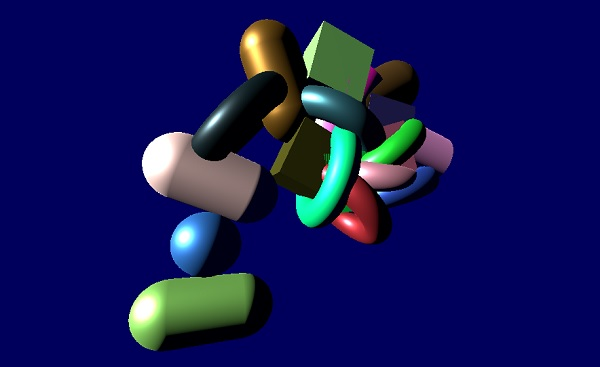
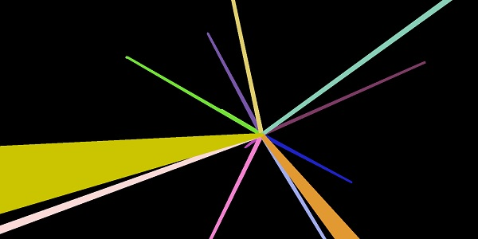

# Godot3DInterpreter - new version 0.analysed      

a lowlevel logo-like interpreter to produce 3D-graphics with Godot.    
in godotforum: https://godotforums.org/d/32849-godot3dinterpreter-logolike-project              
Its based on a good tutorial https://strongminds.dk/artikler/writing-a-small-parser-interpreter-part-1-scanner/   
and from this very good tutorial https://ruslanspivak.com/lsbasi-part18/ i changed the variable system to AR and stack, procedures with parameter and recursion now work.     

- written in C# with Godot 4.0 mono 

example interpreterprogram procedure with PENSIZE 3:    

   
example interpreterprogram meshes:    

    
     
example interpreterprogram recursive tree:    

example interpreterprogram lasershow.g3i:    

    
# Welcome back commander:    
when you start you see the commander below - a one line TextEditor. and in the top left corner the output window of the commander. in the middle of the screen you see the "turtle", the 3D-cursor that shows to the direction, you will draw.   

if you enter in the commander for example   
PRINT "[hello world]    
and the string is printed to GODOT-output.    

or you type:    
FORWARD 30    
and enter with Return, you see the turtle moves and draws a line - a 3D-line of MeshInstance3D. Then enter   
LEFT 90   
and again FORWARD 30 and you see the next line. If you enter for example:   
REPEAT 4 [ FORWARD 30 LEFT 90 ]   
you get a square. you can move camera3D with keys WASD and arrowkeys.       

You can write a procedure if you type TO "X :N   PRINT :N   END    
and can call it from the commander with GO "X 42
and the procedure will write 42 to Godot-output.

If you want interpreterprograms, type LOAD and you can load one of the example-programs in the interpreterprograms-directory. You can write with your editor others and load them with load.   
   

  
# Commands commander (lowercase allowed):   
arrow-up pressed in commander repeats last command    
LOAD - If you want interpreterprograms, type LOAD and you can load one of the example-programs in the interpreterprograms-directory. You can write with your editor others and load them with load.   
PRINTOUT string - prints a procedure or with "ALL it prints all procedures.    
ERASE string - erases a procedure or with "ALL it erases all procedures.    
HELP - print helpmessages   
QUIT - quit program    

   
    
   
# Commands 3D (lowercase allowed):   
camera3D movement with Keys WASD, Arrowkeys   
FORWARD number - draw a line forward    
BACK number   
LEFT number - change left in degrees   
RIGHT number   
UP number (cause we are in 3D)   
DOWN number (cause we are in 3D)   
PENUP    
PENDOWN    
PENSIZE number - thickness of 3d lines, normal is 1. now the lines are thin boxes MeshInstance3D.    
HOME   
CLEAN - clear all       
PENCOLOR number number number - the numbers should be 0-255, also you can type RANDOM then a random number is generated     
BACKGROUND number number number - backgroundcolor, the numbers should be 0-255, also you can type RANDOM then a random number is generated     
CAMERA number number number - move the camera relativ, CAMERA 0 0 100 moves the camera +100 Z, look for example interpreterprogram  procedure.g3i        
MESH meshnamestring number - draws a mesh (godot MeshInstance3D) with size n, example MESH "SPHERE 30    
   possible meshes are SPHERE, BOX, TORUS, CAPSULE, CYLINDER, PLANE, QUAD, PRISM    

   
# Commands interpreter "language" (lowercase allowed): 
7 - a number, -7 is a minus seven        
0.7 - a floatnumber   
; xxx - a comment   
"X - a string   
"[xx xx] - a string with spaces, for example "[hello world]   
MAKE "variablename number/string - declare a variable, NO GLOBAL variables, get the value with :variablename, change with "X = 7, example: MAKE "X 7    PRINT :X   
PRINT string - print   
REPEAT number [ xxx ] - repeat something example: REPEAT 4 [ FORWARD 30 LEFT 90 ]   
FOR varname number number number [ xxx ] - for loop, example: FOR "I 1 3 1 [ PRINT :I ]   
WHILE expression [ dosomething ] - example MAKE "X 0 WHILE :X < 7 [ "X = :X + 1  PRINT :X ]
    cause expression works with float, for example 2<1 + 3<1 works cause 2<1 is 0.0float and the results could be added...    
IF condition dosomething ENDIF - if command, example IF :N > 7 PRINT :N ENDIF       
TO procedurename xxx formalparameters END - a procedure, parameter allowed ( recursion now works, see example ), example TO "PROC :A PRINT :A END    
GO procedurename arguments - start a procedure, parameter allowed, NO nested procedures(proc in proc), example GO "PROC 42. for recursion the STOP-command now works, see example treewithstopcommand.g3i             
RANDOM as parameter, if RANDOM alone means 0-255, or RANDOM n for number, for example FORWARD RANDOM 50 means forward 0-49   
math with */+- and parenthesis () behind a = EQUALS TOKEN. for floatnumbers use dot as comma. or behind procedureparamtervariable example: MAKE "X 0  "X = :X + 7  PRINT :X, now also with float. or math in procedureparameter example: TO "PROC :N   PRINT :N   END ->call-> MAKE "A 2   GO "PROC :A + 1, see also example recursiontest             
SLEEP number - sleep n milliseconds (see example procedure.g3i)   
      
      
  
# Last changes:    
- start parser as thread, now changing scene is possible. new command SLEEP, see example lasershow.g3i.      
- Valk made changes, thank you for the work!    
- added a window for commanderoutput, repeat last command with arrow-up in commander and a semanticanalyser at start checking undeclared variables      
- WHILE command that works til expression greater 0           
  
